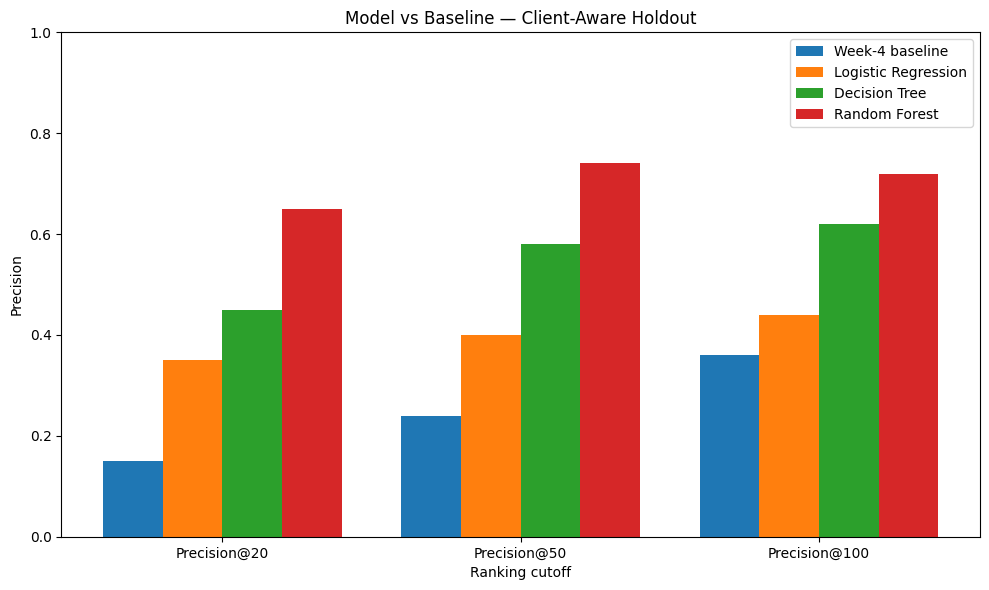
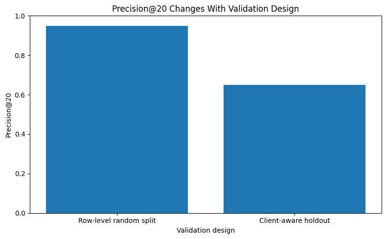

# Machine Learning Ranking for Content Review Prioritization

**Author:** Muhammad Hassan

**Lane:** Machine Learning / Content Opportunity Scoring

**Repository:** `mhassanbuilds/flyrank-ml-internship`

**Date:** August 28, 2026

---

## 0. Abstract

This capstone investigates whether content, search, historical-performance, and freshness signals can be used to prioritize pages for human-reviewed content refresh opportunities. The analysis uses the FlyRank Internship Warehouse and a processed modeling dataset containing 30,000 observations and 52 model features, with `is_declining_label` as the prediction target. Multiple approaches were evaluated, including a Week-4 baseline, Logistic Regression, Decision Tree, and Random Forest, using a client-aware holdout as the primary validation design. The Random Forest achieved measured Precision@20 of 0.65, Precision@50 of 0.74, and Precision@100 of 0.72 on the client-aware holdout, providing the strongest ranking performance among the evaluated approaches. The resulting model score is intended as a decision-support signal for prioritizing pages for human review, not as an automatic refresh decision or proof of causal improvement in search performance.

---

## 1. Problem Framing

### Research Question

Can content, search, historical-performance, and freshness signals be used to prioritize pages for human-reviewed content refresh opportunities?

### Decision Supported

The analysis supports a content team's decision about which pages should be reviewed first when there are more potential pages than a team can manually assess at once.

The model produces a ranking signal that can help reviewers decide where to look first. It does not automatically determine which page should be refreshed.

### Unit of Analysis

The unit of analysis is an individual content page/observation represented in the processed modeling dataset.

### Intended Output

The primary output is a model probability score that can be used to rank pages by their potential relevance to the `is_declining_label` condition.

### Human Action

A reviewer can use the ranking to:

1. Review the highest-ranked pages first.
2. Check search intent and content freshness.
3. Inspect supporting performance signals.
4. Decide whether to refresh, monitor, or take no action.

### Cost of a Wrong Call

A false positive can cause a team to spend time reviewing or refreshing content that does not require intervention. A false negative can cause a potentially useful content opportunity to be overlooked.

The ranking system therefore prioritizes efficient human review rather than fully automating the decision.

---

## 2. Data Safety

### Dataset

This capstone uses the FlyRank Internship Warehouse and the processed feature vector used in the modeling workflow.

The final modeling dataset contains **30,000 observations and 52 model features**.

The features include search-demand signals, historical performance measures, content attributes, content age and freshness measures, and categorical feature tiers.

The target used in the experiment is `is_declining_label`.

### Data Sources

The underlying warehouse contains daily content-performance data, content and client dimensions, and 90-day content-query data. The daily performance table used in the earlier data contract was `fact_content_daily_performance`, with `dim_content` and `dim_clients` available as supporting dimensions.

For the initial analysis, the selected observation window was **March 1, 2026 through March 31, 2026**. Google Search Console records were restricted to rows where GSC data was available.

### Public-Safety Restrictions

No client names, domains, URLs, private queries, credentials, or raw restricted exports are included in the public-facing analysis.

Pseudonymous identifiers are used for grouping and validation purposes rather than as predictive features.

### Excluded Fields and Leakage Risks

The project deliberately avoids using label-derived fields such as `trend_direction` and `trend_pct` as direct model features when they would encode the outcome.

Historical-performance features were treated as requiring measurement-window verification because their predictive use depends on whether the information would have been available before the outcome period.

Search-demand features were also treated as requiring prediction-time availability checks.

These checks identify potential leakage risks but do not prove that the complete dataset is free from temporal leakage.

---

## 3. Baseline

The Week-4 baseline provides a transparent reference point for evaluating the machine-learning approaches.

The baseline is evaluated on the same client-aware holdout used for the final model comparison.

| Metric        | Week-4 Baseline |
| ------------- | --------------: |
| Precision@20  |            0.15 |
| Precision@50  |            0.24 |
| Precision@100 |            0.36 |

The baseline is important because it provides a simple reference against which the more complex models can be evaluated.

The baseline is not treated as a causal benchmark. It is a transparent ranking reference for the capstone experiment.

---

## 4. Model / Analysis

### Modeling Approach

The workflow uses the official feature vector and the Week-4 baseline scoring approach, followed by the Week-5 Random Forest model.

The prediction target is `is_declining_label`.

The final model uses **52 features** constructed from the available content and search-performance signals.

A Random Forest classifier is used to estimate a probability score for each content item. This probability is used as the primary signal for ranking potential content-review opportunities.

### Validation Design

Two validation designs were examined:

1. A row-level random 80/20 split.
2. A client-aware holdout in which clients represented in the test set were not used for training.

The row-level random split is included as a validation-sensitivity comparison. The client-aware holdout is the primary evaluation because it provides a more conservative assessment of generalization across held-out clients.

The client-aware split contains:

* **27,675 training rows**
* **2,325 test rows**

### Leakage Audit

The feature-level audit covered all 52 model features.

| Audit Category                                          | Feature Count |
| ------------------------------------------------------- | ------------: |
| Direct target-related features identified by name       |             0 |
| Historical-performance features requiring window review |            20 |
| Search-demand features requiring prediction-time checks |             7 |
| Features with no obvious leakage from feature names     |            25 |
| **Total**                                               |        **52** |

The audit is a screening check rather than proof that the dataset is completely free from temporal leakage.

### Key Assumption

The main operational assumption is that observable historical content and search-performance signals contain useful information for prioritizing pages that warrant human review.

This is an analytical assumption, not a claim about Google's ranking algorithm.

---

## 5. Evaluation

### Evaluation Setup

The final approaches were evaluated on the same client-aware holdout.

Precision@20, Precision@50, and Precision@100 are used because the practical objective is to prioritize a limited number of pages for human review.

### Model Comparison

| Method              | Precision@20 | Precision@50 | Precision@100 |
| ------------------- | -----------: | -----------: | ------------: |
| Week-4 baseline     |         0.15 |         0.24 |          0.36 |
| Logistic Regression |         0.35 |         0.40 |          0.44 |
| Decision Tree       |         0.45 |         0.58 |          0.62 |
| **Random Forest**   |     **0.65** |     **0.74** |      **0.72** |

The Random Forest produced the strongest measured ranking performance among the evaluated approaches.

### Figure 1 — Model Comparison



*Figure 1. Precision@20, Precision@50, and Precision@100 for the Week-4 baseline, Logistic Regression, Decision Tree, and Random Forest on the client-aware holdout.*

### Validation Sensitivity

The Random Forest measured different performance under different validation designs.

| Validation Design      | Precision@20 |
| ---------------------- | -----------: |
| Row-level random split |         0.95 |
| Client-aware holdout   |         0.65 |

### Figure 2 — Validation Design Comparison



*Figure 2. Measured Precision@20 under the row-level random split and the client-aware holdout.*

The difference demonstrates that measured performance depends on validation design. The client-aware result is therefore used as the more conservative result for the capstone's main interpretation.

### Error Analysis

The client-aware evaluation contained **762 incorrect predictions** at the classification threshold used during the Week-6 inspection.

Incorrect predictions demonstrate that the model does not perfectly identify every observation. The model score should therefore be treated as a ranking and decision-support signal rather than as an automatic decision rule.

### Evaluation Interpretation

The Random Forest achieved:

* **Precision@20: 0.65**
* **Precision@50: 0.74**
* **Precision@100: 0.72**

The Week-4 baseline achieved:

* **Precision@20: 0.15**
* **Precision@50: 0.24**
* **Precision@100: 0.36**

These are observed measurements on the tested client-aware holdout.

They indicate that the Random Forest provided the strongest ranking signal among the approaches tested in this experiment.

They do not establish that refreshing the highest-ranked pages will cause improved rankings, clicks, impressions, or traffic.

---

## 6. Interpretation

The Random Forest provided the strongest measured ranking performance among the approaches tested.

Its strongest measured result was Precision@50 of **0.74**, followed by Precision@100 of **0.72** and Precision@20 of **0.65** on the client-aware holdout.

The validation sensitivity analysis is an important finding. The same model measured Precision@20 of **0.95** under a row-level random split but **0.65** under the client-aware holdout. This shows why the client-aware result is used as the primary interpretation.

The leakage audit identified 52 model features. No features were directly identified as target-related by the feature-name check. However, 20 historical-performance features require measurement-window review and 7 search-demand features require verification that they were available at prediction time.

The model therefore identifies patterns in the available data that can support prioritization.

It does not reproduce Google's ranking algorithm, reveal Google's ranking factors, or prove that a particular content change will improve search performance.

### What the Model Found

The useful result is not simply that one classifier produced a higher metric.

The workflow demonstrated that a combination of content, search, historical-performance, and freshness-related signals can produce a measurable ranking signal under the tested evaluation setup.

### Negative / Cautionary Finding

Validation design materially changes measured performance.

A high result from a row-level random split should not be treated as equivalent to performance on unseen clients.

This is one reason the capstone emphasizes the client-aware holdout and careful interpretation.

---

## 7. Recommendation

### Ranked Action Playbook

The model output should be used to prioritize human review rather than to automatically change content.

### Priority 1 — Review Highest-Ranked Pages

Start with pages receiving the highest model scores.

For each page, the reviewer should check:

* whether the page is still aligned with the intended search intent;
* whether the content is sufficiently current;
* whether important information is missing or outdated;
* whether historical search-performance signals support further investigation;
* whether the appropriate action is refresh, monitor, or no action.

### Priority 2 — Review Older or Less-Fresh Content

Pages with stronger age or freshness signals should receive additional attention when they also receive a high model score.

Age should not be treated as an automatic reason to refresh a page.

### Priority 3 — Review Search-Performance Signals

Review pages with meaningful historical search-performance signals alongside their model score.

A page should not be prioritized solely because it has high impressions, clicks, or another individual metric.

### Priority 4 — Human Review Before Action

Before refreshing a page, reviewers should confirm that the recommended action makes sense for the content and search intent.

Possible outcomes are:

1. **Refresh** — the page has a clear content opportunity.
2. **Monitor** — the page should be watched but does not currently justify a refresh.
3. **No action** — the model score does not translate into a meaningful content opportunity after review.

### Decision-Support Principle

The model answers:

> **Where should the content team look first?**

It does not answer:

> **Which exact content change will improve Google rankings?**

This distinction keeps the workflow aligned with the evidence available from the observational dataset.

---

## Supporting Artifacts

### Artifact 1 — Model Comparison

The model-comparison table and Figure 1 provide the primary evidence for the model-versus-baseline evaluation.

### Artifact 2 — Validation Comparison

The validation table and Figure 2 show why the client-aware holdout is used as the primary evaluation.

### Artifact 3 — Leakage Audit

The 52-feature leakage audit documents the direct feature-name checks and the historical-window and prediction-time review requirements.

### Artifact 4 — Failure Analysis

The evaluation recorded **762 incorrect predictions** on the client-aware test set at the inspected classification threshold.

### Artifact 5 — Ranked Action Playbook

The action playbook translates the model score into a practical human-review workflow.

---

## 8. Reproducibility

The capstone notebook is stored in:

`work/notebooks/capstone.ipynb`

The notebook contains the research question, data description, modeling workflow, validation checks, model comparison, artifact generation, recommendations, and ML-12 closing materials.

The primary evaluation uses a client-aware holdout with:

* **27,675 training rows**
* **2,325 test rows**
* **52 model features**
* Target: `is_declining_label`

The final Random Forest results reported in this paper are:

* Precision@20 = **0.65**
* Precision@50 = **0.74**
* Precision@100 = **0.72**

The notebook includes assertions that check the reported model and baseline metrics.

### Reproduction Notes

A fresh clone should be used to re-run the notebook and verify the reported results before final submission.

The public repository should contain the notebook and supporting report artifacts but should not contain raw datasets or restricted client information.

The repository structure is intended to keep the experiment reproducible while respecting the project's public-safety requirements:

```text
work/
├── notebooks/
│   ├── w01_research_question.ipynb
│   ├── w02_ml_task_framing.ipynb
│   ├── w03_data_contract.ipynb
│   ├── w04_baseline_score.ipynb
│   ├── w05_model.ipynb
│   ├── w06_validation_audit.ipynb
│   ├── w07_action_playbook.ipynb
│   └── capstone.ipynb
├── figures/
│   ├── model_comparison.png
│   └── validation_sensitivity.png
├── README.md
├── capstone_report.md
└── capstone_report_template.md
```

---

## 9. Acknowledgments & Data Credit

This capstone was built as part of the FlyRank ML Internship.

The analysis uses the FlyRank Internship dataset and follows the project's public-safety and reproducibility requirements.

**Data credit:** Built on the FlyRank ML Internship dataset.

[FlyRank](https://flyrank.ai)

---

## Capstone Evidence Summary

| Evidence                                                |               Result |
| ------------------------------------------------------- | -------------------: |
| Modeling observations                                   |               30,000 |
| Model features                                          |                   52 |
| Primary validation                                      | Client-aware holdout |
| Training rows                                           |               27,675 |
| Test rows                                               |                2,325 |
| Random Forest Precision@20                              |                 0.65 |
| Random Forest Precision@50                              |                 0.74 |
| Random Forest Precision@100                             |                 0.72 |
| Week-4 baseline Precision@20                            |                 0.15 |
| Week-4 baseline Precision@50                            |                 0.24 |
| Week-4 baseline Precision@100                           |                 0.36 |
| Row-level split Precision@20                            |                 0.95 |
| Incorrect predictions inspected                         |                  762 |
| Direct target-related features identified by name       |                    0 |
| Historical-performance features requiring review        |                   20 |
| Search-demand features requiring prediction-time checks |                    7 |

---

## ML-12 — 5-Minute Demo Outline

### 1. Research Question — 30 seconds

Explain the decision problem: identifying which pages should be reviewed first for potential content refresh.

### 2. Data and Methodology — 60 seconds

Explain that the analysis uses content, search, historical-performance, age, and freshness signals and predicts the `is_declining_label`.

### 3. Model Comparison — 60 seconds

Show the comparison between the Week-4 baseline, Logistic Regression, Decision Tree, and Random Forest.

The Random Forest measured:

* **0.65 Precision@20**
* **0.74 Precision@50**
* **0.72 Precision@100**

on the client-aware holdout.

### 4. Validation and Leakage — 60 seconds

Explain why the client-aware holdout is more conservative than the row-level random split and summarize the feature-timing leakage checks.

### 5. Recommendations — 60 seconds

Show how the model score can help reviewers decide which pages to inspect first while keeping the final decision with a human reviewer.

### 6. Limitations — 30 seconds

Emphasize that the analysis is observational and does not prove that refreshing a page will cause better search performance.

---

## Social-Post Cut

I completed a machine-learning ranking workflow for prioritizing content-review opportunities.

The final evaluation compared a Week-4 baseline, Logistic Regression, Decision Tree, and Random Forest using a client-aware holdout.

The Random Forest achieved measured Precision@20 of 0.65, Precision@50 of 0.74, and Precision@100 of 0.72.

One of the biggest lessons was that validation design matters. The same model measured 0.95 Precision@20 under a row-level random split but 0.65 under the client-aware holdout.

The final output is positioned as decision-support for human review rather than an automatic content-refresh decision.

---

## Employer-Facing Summary

I built and evaluated a machine-learning ranking workflow for prioritizing content-review opportunities. I compared multiple approaches against a baseline and evaluated the final model using a client-aware holdout to obtain a more conservative estimate of generalization. The work also included feature-level leakage checks, failure analysis, ranked recommendations, and careful communication of observational results without making unsupported causal claims.

